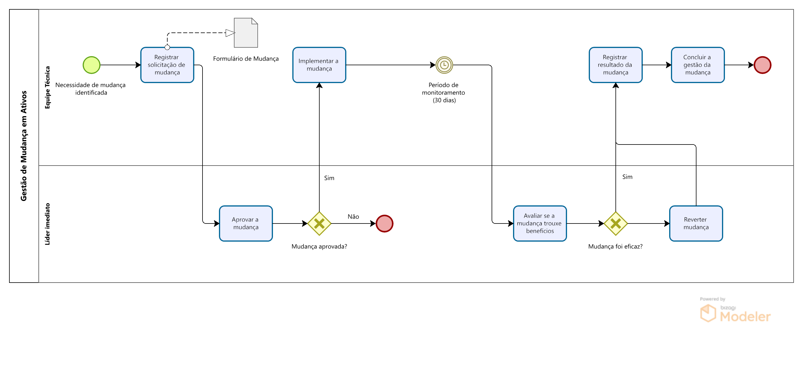

# BPMN - Gestão de Mudança em Ativos

Este projeto apresenta a modelagem de um **processo simplificado** de Gestão de Mudança em Ativos utilizando **BPMN 2.0**.

## Ferramenta utilizada

Bizagi Modeler

## Objetivo do processo

Representar, de forma simplificada, um fluxo de gestão de mudanças em ativos, incluindo:

- Registro da solicitação de mudança
- Avaliação e aprovação da mudança
- Implementação da mudança
- Período de monitoramento
- Avaliação de eficácia
- Reversão ou conclusão da mudança

## Estrutura do processo

## Descrição do fluxo

O processo modelado contempla as principais etapas para tratamento de uma mudança em ativos, desde a identificação da necessidade até a conclusão da gestão da mudança.

O fluxo inclui:

- Registro formal da solicitação por meio de formulário
- Aprovação da mudança pelo líder imediato
- Implementação da mudança pela equipe técnica
- Monitoramento por 30 dias
- Avaliação de eficácia da mudança
- Possibilidade de reversão, caso a mudança não apresente os benefícios esperados
- Registro do resultado e conclusão da gestão da mudança

## Informações do projeto

- **Notação:** BPMN 2.0
- **Tipo de processo:** Gestão de Mudança em Ativos
- **Área de aplicação:** Manutenção e gestão de ativos industriais
- **Nível de detalhamento:** Processo simplificado

## Arquivos do projeto

- gestao_mudanca_ativos_bpmn.png → Imagem do diagrama BPMN
- gestao_mudanca_ativos.bpm → Arquivo editável do Bizagi

## Autora

**Gabriela Cerqueira**

## Sobre a autora

Gabriela Cerqueira é profissional com experiência em **gestão de processos, gestão de ativos, melhoria contínua e padronização de fluxos operacionais**, com atuação em contextos industriais e organizacionais que exigem controle, rastreabilidade e eficiência.

Este projeto demonstra a aplicação de modelagem de processos para representação estruturada de fluxos de mudança, com foco em clareza, governança e apoio à tomada de decisão.

# ⚠️ Observação

Este projeto utiliza **dados fictícios**, criados exclusivamente para fins educacionais e demonstração de habilidades em mapeamento BPMN.
